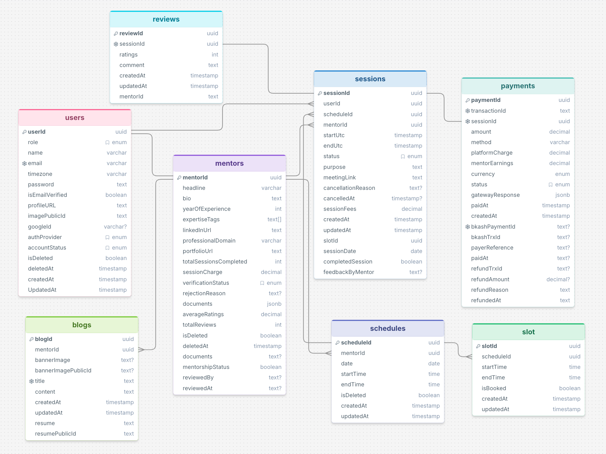

# Adviso - Mentor Booking & Consultation Platform

Adviso is a production-grade backend REST API built to streamline 1-on-1 mentorship bookings, secure payments, and professional knowledge sharing. It offers role-based access control (RBAC), conflict-free scheduling, automated slot management, and advanced search and filtering.

---

## Live Links & Resources

* **Live Backend API:** [LINK](https://adviso-backend.vercel.app)
* **Demonstration Video:** [Watch Project Walkthrough](https://drive.google.com/file/d/12wI9XQdOzY8RtlAfEB0AtOBtGqMLhQX1/view?usp=sharing)

---

## Entity Relationship Diagram (ERD)




---

## System Flow

1. **Authentication & Roles:** Users register and authenticate via JWT. Supported roles include `USER`, `MENTOR`, `ADMIN`, and `SUPER_ADMIN`.
2. **Mentor Onboarding:** Users apply for mentorship status with professional domains, experience, and credentials. Admins review and approve applications.
3. **Availability & Scheduling:** Approved mentors generate available consultation dates and discrete booking slots (`Slot`).
4. **Booking & Automated Release:** A user selects a slot to schedule a `Session`. If payment is not completed within 15 minutes, an automated background cron job cancels the pending session and releases the slot for other users.
5. **Knowledge Sharing:** Mentors write technical blogs with Cloudinary-backed banner images.

---

## Demo Credentials

| Role | Email | Password |
|---|---|---|
| **Default User** | `user@gmail.com` | `User@user12345` |
| **Default Admin** | `admin@gmail.com` | `Admin@admin12345` |
| **Demo Mentor** | `tahmid.rahman@example.com` | `Password123!` |

---
## Tech Stack

| Category | Technology | Purpose |
|---|---|---|
| **Runtime & Core** | Node.js (ES Modules), TypeScript, Express.js | Backend server runtime and REST API framework |
| **Database & ORM** | PostgreSQL (Neon Serverless), Prisma ORM (`@prisma/client`, `@prisma/adapter-pg`, `pg`) | Relational database modeling, migrations, and query execution |
| **Caching & In-Memory** | Redis (`redis`) | High-speed data caching and session/rate tracking |
| **Validation & Security** | Zod, BcryptJS, JWT (`jsonwebtoken`), Google Auth Library, Express Rate Limit | Request schema validation, password hashing, RBAC, OAuth2 verification, and DDoS protection |
| **Media & File Handling**| Cloudinary, Multer, PDFKit | Cloud asset management, multipart file uploads, and PDF invoice/document generation |
| **Email & Templating** | Nodemailer, EJS | Dynamic HTML transactional emails and notifications |
| **Automation** | Node-Cron | Scheduled cron jobs for automatic slot release and data cleanup |
| **Build & Tooling** | Tsup, TSX, Biome (`@biomejs/biome`) | Bundling, TypeScript hot-reload execution, high-performance linting and formatting |

---

## Prisma Schemas Overview

The database uses multi-file schema modularity located in the `prisma/schema` directory to enforce clean boundaries:

* **`user.prisma`**: Base user model storing credentials, authentication providers (`CREDENTIALS`, `GOOGLE`), roles, status, and verification state.
* **`mentor.prisma`**: Extends approved users with professional domains, bios, experience, verification workflows, hourly rates, and aggregate ratings.
* **`schedule.prisma`**: Stores mentor availability on designated dates, serving as the parent container for time slots.
* **`slot.prisma`**: Discrete, atomic time blocks linked to schedules that track booking status (`isBooked`).
* **`session.prisma`**: Manages booked consultations between a mentee and mentor, capturing meeting URLs, schedule metadata, and completion status.
* **`payment.prisma`**: Handles billing records, bKash integration details, transaction IDs, platform fee splits, and refund tracking.
* **`review.prisma`**: Stores mentee ratings and feedback for completed sessions, updating mentor score aggregates.
* **`blog.prisma`**: Facilitates mentor-authored articles, rich content, and Cloudinary-hosted banner assets.
* **`enums.prisma`**: Centralized definitions for status enums (e.g., `Role`, `SessionStatus`, `PaymentStatus`, `MentorshipStatus`).

---

## Architectural Modules

The backend follows a modular feature architecture inside `src/module`:

| Module | Core Responsibilities |
|---|---|
| **`auth`** | Handles user registration, credentials login, Google OAuth, password resets, and JWT issuance. |
| **`user`** | Manages user profiles, role assignments, soft-delete operations, and administrative account moderation. |
| **`mentor`** | Drives mentor onboarding, document submissions, admin verification workflows, and public directory filtering. |
| **`schedule`** | Powers mentor availability creation, schedule configuration, and calendar management. |
| **`slot`** | Handles discrete time-slot generation, availability queries, and conflict-detection engines. |
| **`session`** | Governs booking lifecycles, session confirmation, cancellation logic, and meeting links. |
| **`payment`** | Orchestrates bKash checkout workflows, webhook validations, fee deductions, and refund settlements. |
| **`review`** | Processes ratings/feedback submissions and recalculates mentor average review scores. |
| **`blog`** | Manages CRUD operations, image uploads, and public feed pagination for articles. |
| **`analytics`** | Aggregates platform metrics, booking volumes, mentor earnings, and administrative dashboard reports. |

---

## Postman Documentation

The complete API collection with environment configurations, route payloads, and edge cases is included in the project root:
* **File:** `Adviso.postman_collection.json`
* **Usage:** Open Postman -> **Import** -> Select `Adviso.postman_collection.json`.

---

## Getting Started

1. Clone the repository and install dependencies:
   ```bash
   npm install